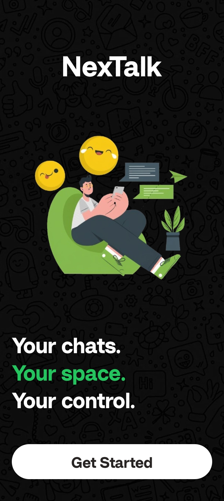
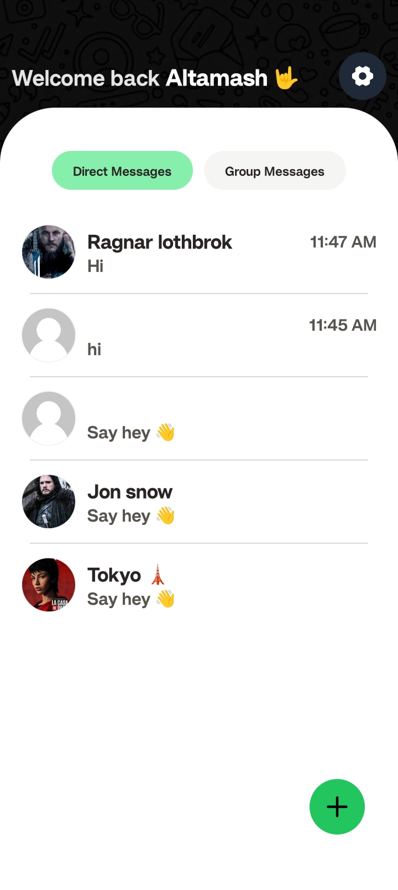
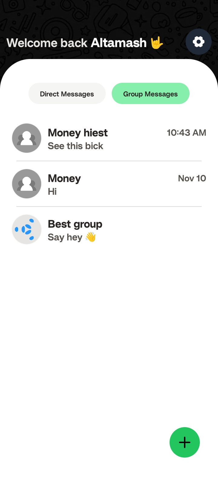
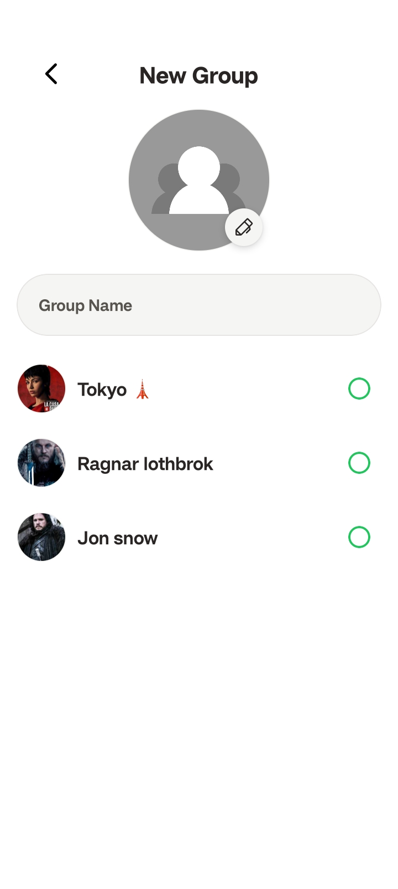
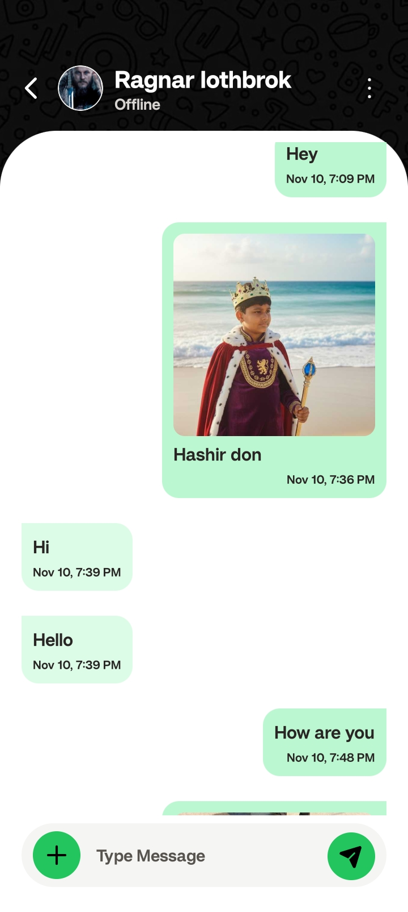

# 💬 NexTalk – Real-Time Chat App (React Native + Node.js + Socket.IO)


> **NexTalk** is a full-stack real-time chat application with one-to-one and group messaging, built using **React Native**, **Node.js**, **Express**, **MongoDB**, and **Socket.IO**.  
It supports online/offline user status, image attachments, and a sleek modern UI powered by **Tailwind-like styling**.

---

## 🚀 Features

- ⚡ **Real-time messaging** (Socket.IO)
- 👥 **1-to-1 and Group Chats**
- 🖼️ **Image upload** (via Cloudinary)
- 🟢 **Online / Last Seen indicator**
- 🔒 **JWT-based authentication**
- 💾 **MongoDB database (Mongoose models)**
- 📱 **Beautiful React Native UI**
- 🧠 **Context-based Auth state management**
- ☁️ **Backend ready for deployment (Railway / Render / Vercel)**

---

## 🏗️ Tech Stack

**Frontend (Mobile App):**
- React Native (Expo)
- TypeScript
- Socket.IO Client
- Async Storage (JWT storage)
- Phosphor React Native Icons

**Backend:**
- Node.js + Express
- MongoDB + Mongoose
- Socket.IO (real-time engine)
- JWT Authentication
- Cloudinary (for image uploads)

---

## 📸 Screenshots (Preview)

| Wellcome Screen | Home screen | Group tab |
|--------------|--------------|------------|
|  |  |  |


| New Group Screen | Chat screen | Group tab |
|--------------|--------------|------------|
|  |  |  |


---

## ⚙️ Setup Instructions

### 1️⃣ Clone the Repository
```bash
git clone https://github.com/SkAltmash/NexTalk-the-chatApp.git
cd NexTalk-the-chatApp
```

### 2️⃣ Install Dependencies
Backend
```bash
cd backend
npm install
```
Frontend
```
cd frontend
npm install

```

### 3️⃣ Configure Environment Variables
Create a .env file inside the backend folder:
```bash
PORT = 3000
MONGO_URI = your_mongodb_connection_string
JWT_SECRET = keep it SECRET
```

### 4️⃣ Run the App
Start Backend
```bash
npm run dev
```
Start Frontend (Expo)
```bash
npx expo Start
```
---

## 🧩 Folder Structure
```
📦 NexTalk-the-chatApp
 ┣ 📂 backend
 ┃ ┣ 📂 models
 ┃ ┣ 📂 routes
 ┃ ┣ 📂 socket
 ┃ ┣ 📜 index.ts
 ┃ ┗ 📜 .env
 ┣ 📂 frontend
 ┃ ┣ 📂 components
 ┃ ┣ 📂 contexts
 ┃ ┣ 📂 screens
 ┃ ┣ 📂 services
 ┃ ┣ 📂 socket
 ┃ ┗ 📂 app
 ┃   ┃
 ┃   ┣(main) 
 ┃   ┃
 ┃   ┗(auth)
 ┗ 📜 README.md

 ```

---
## 🌍 Deployment

Backend

You can deploy it easily using:

[Railway.app](https://railway.com/)

[Render.com](https://render.com/)

Frontend
```bash
npx expo build:android
```
or run it directly:
```bash
npx expo start
```
___

## 🧠 Future Improvements

- 🔔 Push Notifications (FCM / Expo Notifications)

- 📞 Voice & Video Calls (WebRTC)

- 👀 Message Seen / Typing Indicators

- 🌐 PWA version for web chat

- 🧑‍💻 User Profile Customization

___


## 🧑‍💻 Author
👋 Altamash Sheikh

- [💼 LinkedIn](https://www.linkedin.com/in/altamash-sheikh-1ba6a72aa/)
- [🌐 GitHub](https://github.com/SkAltmash)
___